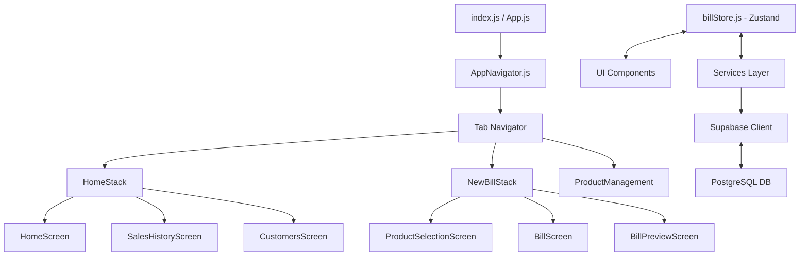

# Architecture

> Auto-generated by /map on 2026-04-11

## Overview

The Wholesale App is a React Native (Expo) application designed for B2B billing and inventory management. It uses Supabase as a backend-as-a-service for data storage and real-time capabilities, with Zustand managing the local application state, specifically the active billing session.

## Components

### UI Components
- **Screens**: Found in `src/screens/`. Includes dashboard, history, customer management, product selection, and billing editor.
- **Shared Components**: Found in `src/components/`. Includes `GlassCard`, `ProductCard`, `SearchBar`, and `BillItem`.
- **Navigation**: Found in `src/navigation/AppNavigator.js`. Manages global navigation state and stacks.

### Logic & Data Layer
- **Services**: Found in `src/services/`. Abstract Supabase calls into reusable business logic (`billService`, `productService`, `customerService`).
- **Store**: Found in `src/store/billStore.js`. Centralized state for the active cart, customer details, and bill editing.
- **Lib**: Found in `src/lib/supabase.js`. Configures the Supabase client and provides mock toggles.

## Data Flow

1. **Product Selection**: User selects products from `ProductSelectionScreen`. Selected items are added to the Zustand `billStore`.
2. **Bill Editing**: User reviews items, adjusts quantities/rates in `BillScreen`, and adds customer details.
3. **Bill Preview**: `BillPreviewScreen` generates a visual summary and total calculations from the store.
4. **Saving**: `billService.saveBill` (or `updateBill`) sends the header (`bills` table) and line items (`bill_items` table) to Supabase in a series of steps (header first, then items).
5. **PDF Generation**: `BillPreviewScreen` uses `expo-print` to generate and share a PDF of the bill.

## Integration Points

| Service | Type | Purpose |
|---------|------|---------|
| Supabase | BaaS | Database storage, authentication (TBD), and RLS security. |
| Expo Print | Native | PDF generation for billing. |
| Expo Sharing | Native | Sharing bill PDFs via WhatsApp, Mail, etc. |

## Technical Debt

- [ ] **Transactions**: Saving bills and items is currently two separate operations. A failure in the second call could leave orphaned bill headers.
- [ ] **Data Persistence**: Zustand state is lost on app restart. Active bills are not persisted locally.
- [ ] **Performance**: Customer search in `billService` is done via JS filtering for uniqueness, which might slow down with many records.
- [ ] **RLS Policies**: RLS is "Public" (enabled but allowing all access), which needs tightening for production security.

## Conventions

- **Naming**: CamelCase for components and store hooks; camelCase for functions and services.
- **Structure**: Grouped by function (screens, components, services, store).
- **Styling**: Uses a centralized `src/theme/index.js` for colors and fonts, often with glassmorphism aesthetics.
